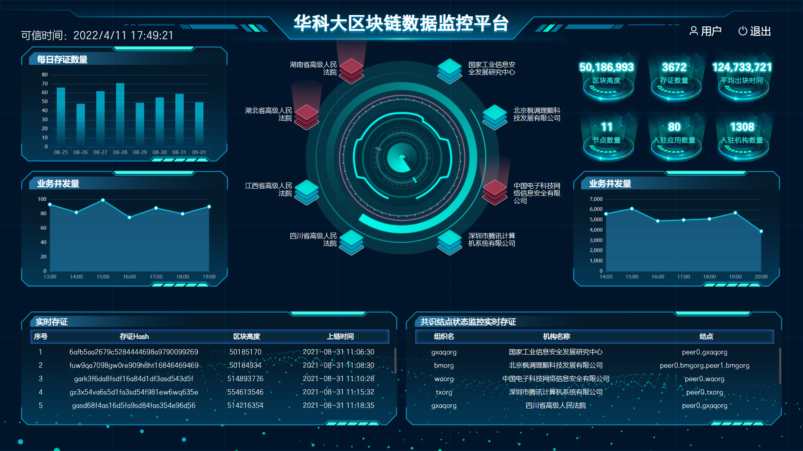

# bigdatapanel

华科土木学院大数据屏项目(原样是动态的)



您可以通过以下操作去启动项目

## Project setup
```
yarn install
```

### Compiles and hot-reloads for development
```
yarn serve
```

### Compiles and minifies for production
```
yarn build
```

### Customize configuration
See [Configuration Reference](https://cli.vuejs.org/config/).